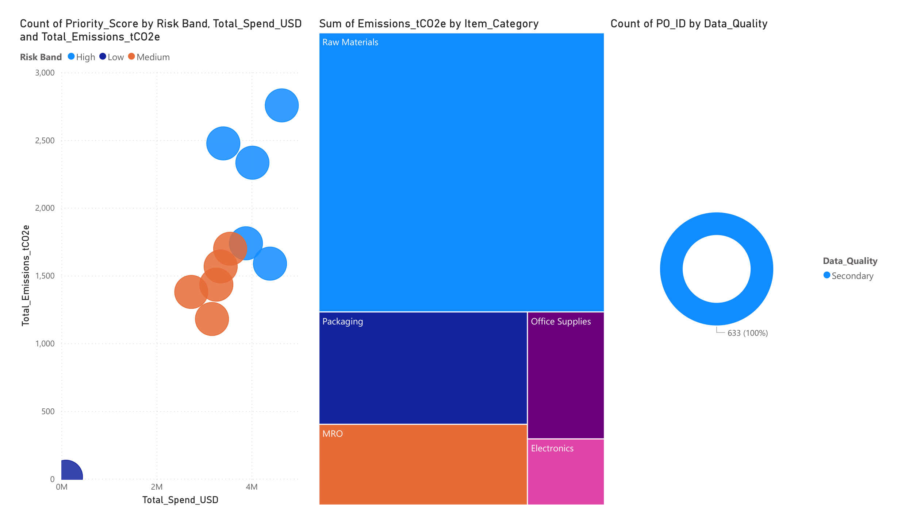
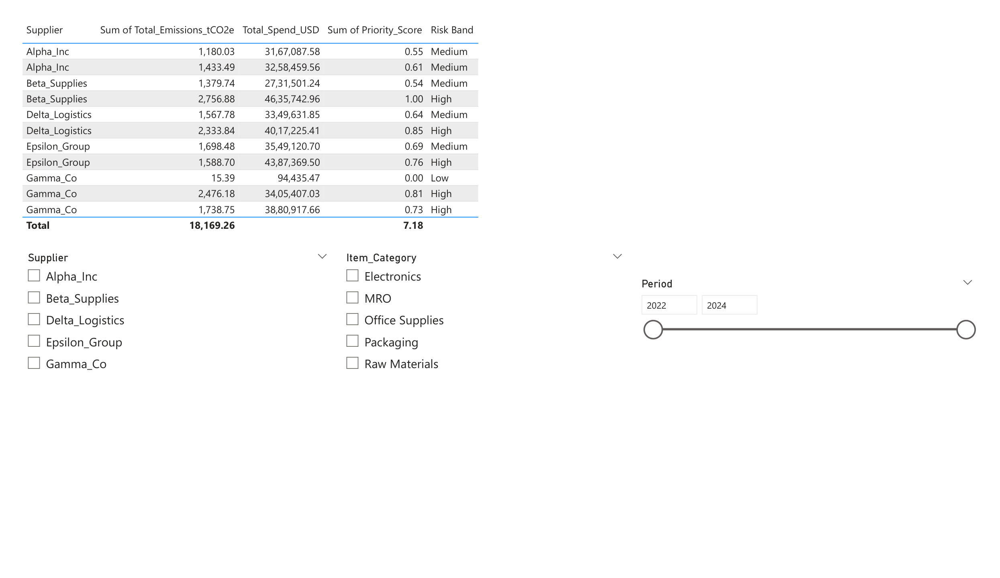

# 🌿 Scope-3 Emissions Snapshot & Supplier Risk Score

> End-to-end data pipeline and predictive analytics system to estimate Scope-3 emissions, identify high-risk suppliers, and deliver actionable insights through an interactive Power BI dashboard.

[]()
[]()
[]()
[]()
[]()
[]()

---

## 📌 Problem Statement

Organizations struggle to quantify **Scope-3 (Category 1: Purchased Goods & Services)** emissions because procurement data is not directly tied to carbon output. This project bridges that gap by:
- Mapping procurement spend to NAICS-based emission factors (US EPA USEEIO v1.2)
- Building a **supplier-level risk score** for prioritization
- Training a **Random Forest model** to predict supplier emissions with 97.6% accuracy (R² = 0.9968)
- Visualizing findings in an interactive **4-page Power BI dashboard**

---

## 🗂️ Project Structure

```
scope3-emissions-analytics/
├── notebooks/
│   ├── scope3_pipeline.ipynb       # ETL: cleaning → NAICS mapping → emissions calc → priority score
│   └── ml_model.ipynb              # ML: feature engineering → 4 models → evaluation → predictions
├── sql/
│   ├── sample_queries.sql          # 5 PostgreSQL queries (CTEs, window functions, LAG, RANK)
│   └── README.md                   # Query reference guide
├── data/
│   ├── sample_dataset.csv          # Sample supplier summary output (5 rows)
│   ├── raw/README.md               # Raw dataset documentation
│   └── processed/README.md         # Pipeline output documentation
├── dashboard/
│   ├── README.md                   # Dashboard pages + DAX measures
│   ├── dashboard_page_1.png        # Executive Overview
│   ├── dashboard_page_2.png        # Supplier & Category Analysis
│   └── dashboard_page_3.png        # Supplier Drilldown
├── requirements.txt
├── .gitignore
└── README.md
```

---

## 🧭 Data Flow

```
Raw Procurement Data (.csv)
        ↓
Cleaning & Filtering (Delivered orders only)
        ↓
Category → NAICS Code Mapping
        ↓
Join with EPA Emission Factors (kg CO₂e / USD)
        ↓
Imputation (NAICS-median for missing EFs)
        ↓
Line-Level Emissions Calculation  →  line_level_emissions_with_imputation.csv
        ↓
Supplier Aggregation + Priority Scoring  →  supplier_summary_with_priority.csv
        ↓
Machine Learning Model  →  supplier_predictions.csv
        ↓
Power BI Dashboard
```

---

## 📥 Datasets Used

### Input Datasets

| Dataset | Source | Key Columns |
|---------|--------|-------------|
| **Procurement Dataset** | [Kaggle — Procurement KPI Analysis](https://www.kaggle.com/datasets) | `Supplier`, `Item_Category`, `Quantity`, `Unit_Price`, `Negotiated_Price`, `Order_Status`, `Order_Date` |
| **Emission Factors** | [US EPA USEEIO v1.2](https://www.epa.gov/land-research/us-environmentally-extended-input-output-useeio-technical-content) | `NAICS6`, `EF_kg_per_USD` (with margins) |
| **NAICS Mapping** | Manually curated | `Item_Category` → `NAICS6` |

> ⚠️ Raw datasets are not committed to this repo (see `.gitignore`). Download from the sources above and place in `data/` before running notebooks.

### Intermediate & Output Datasets

| Dataset | Description |
|---------|-------------|
| `category_to_naics.csv` | Category → NAICS bridge (auto-generated by pipeline) |
| `line_level_emissions_with_imputation.csv` | Per-PO line emissions with imputation flags |
| `supplier_summary_with_priority.csv` | Aggregated supplier spend, emissions, priority score |
| `supplier_predictions.csv` | Actual vs predicted emissions (ML output) |
| `model_comparison.csv` | Performance metrics for all 4 trained models |

---

## ⚙️ Methodology

### ETL Pipeline (`notebooks/scope3_pipeline.ipynb`)

1. **Load & Validate** — Procurement (777 rows) and emission factor (1,016 rows) datasets
2. **Filter** — Retain `Delivered` orders only (633 valid PO lines)
3. **Spend Calculation** — `Spend_USD = Quantity × Effective_Price` (uses Negotiated_Price where available)
4. **NAICS Mapping** — Manual mapping of 5 procurement categories to NAICS-6 codes
5. **EF Join + Imputation** — Left-join with emission factors; missing EFs imputed via NAICS-median
6. **Emissions** — `Emissions_tCO2e = Spend_USD × EF_kg_per_USD / 1000`
7. **Priority Score** — Composite score: `0.5 × Emissions_Norm + 0.5 × Spend_Norm`

### ML Model (`notebooks/ml_model.ipynb`)

| Model | MAE | R² | RMSE | MAPE (%) |
|-------|-----|----|------|----------|
| Linear Regression | 0.3971 | -4.58 | 0.5015 | 5.26 |
| Ridge Regression | 0.2433 | -0.68 | 0.2747 | 3.22 |
| **Random Forest** ✅ | **0.1908** | **0.9968** | **0.2087** | **2.49** |
| Gradient Boosting | 0.2349 | -0.70 | 0.2768 | 3.14 |

**Best model: Random Forest** — lowest MAE (0.1908) & MAPE (2.49%), R² = 0.9968

**Features:** `log_spend`, `PO_Lines`, `spend_per_po`, `Period` (one-hot encoded)

**Target:** `log(Total_Emissions_tCO2e)` — log-transformed for normality

---

## 📊 Key Insights

- **Total Scope-3 Emissions:** ~18,169 tCO₂e across 633 delivered PO lines
- **Total Procurement Spend:** $36.5M
- **Top emitter:** Beta_Supplies — 2,757 tCO₂e (Priority Score: 1.0)
- **100% EF coverage** achieved after NAICS-median imputation
- **Raw Materials** drives highest emission intensity (EF: 1.51 kg CO₂e/USD)

### Top 5 Suppliers by Estimated Emissions

| Supplier | Total Emissions (tCO₂e) | Total Spend (USD) | Priority Score |
|----------|------------------------|-------------------|----------------|
| Beta_Supplies | 2,756.88 | $4,635,743 | 1.000 |
| Delta_Logistics | 2,333.84 | $4,017,225 | 0.855 |
| Gamma_Co | 2,476.18 | $3,405,407 | 0.813 |
| Epsilon_Group | 1,698.48 | $3,549,121 | 0.687 |
| Alpha_Inc | 1,433.49 | $3,258,460 | 0.607 |

---

## 📊 Dashboard

An interactive **4-page Power BI dashboard** built on `supplier_summary_with_priority.csv` and `supplier_predictions.csv`.

### Page 1 — Executive Overview


### Page 2 — Supplier & Category Analysis


### Page 3 — Supplier Drilldown


> See [`dashboard/README.md`](dashboard/README.md) for full page descriptions and DAX measures.

---

## 🚀 How to Run

### Prerequisites
```bash
git clone https://github.com/harshilnagwani/scope3-emissions-analytics.git
cd scope3-emissions-analytics
pip install -r requirements.txt
```

### Steps

1. **Download datasets** and place in `data/`:
   - `procurement_dataset.csv` — from [Kaggle Procurement KPI Analysis](https://www.kaggle.com/datasets)
   - `SupplyChainGHGEmissionFactors_v1.2_NAICS_CO2e_USD_2021.csv` — from [US EPA USEEIO](https://www.epa.gov/land-research/us-environmentally-extended-input-output-useeio-technical-content)

2. **Run ETL pipeline** → generates `supplier_summary_with_priority.csv`
   ```bash
   jupyter notebook notebooks/scope3_pipeline.ipynb
   ```

3. **Run ML model** → generates `supplier_predictions.csv` & `model_comparison.csv`
   ```bash
   jupyter notebook notebooks/ml_model.ipynb
   ```

4. **Open Power BI** → connect to the output CSVs in `data/`

---

## 🛠️ Tech Stack

| Layer | Tools |
|-------|-------|
| Data Engineering | Python 3.11, Pandas, NumPy |
| Emissions Methodology | Spend-based (GHG Protocol Cat. 1, USEEIO EFs) |
| Machine Learning | scikit-learn — Random Forest, Ridge, Gradient Boosting |
| Visualization | Matplotlib, Seaborn, Plotly |
| Business Intelligence | Power BI Desktop, DAX |
| SQL Analytics | PostgreSQL-compatible (CTEs, Window Functions) |

---

## 🔮 Future Improvements

- [ ] Activity-based emissions estimation (beyond spend-based)
- [ ] Automated NAICS mapping via NLP / embeddings
- [ ] ESG risk score integration (compliance rate, defect fraction)
- [ ] Real-time pipeline: PostgreSQL + Airflow + scheduled Power BI refresh
- [ ] Scope-3 Category 4 (Upstream Transportation) expansion

---

## 📚 References

- [US EPA USEEIO Supply Chain Emission Factors v1.2](https://www.epa.gov/land-research/us-environmentally-extended-input-output-useeio-technical-content)
- [GHG Protocol Scope 3 Standard — Category 1](https://ghgprotocol.org/scope-3-standard)
- [NAICS Code System — US Census Bureau](https://www.census.gov/naics/)

---

## 👤 Author

**Harshil Nagwani** — [GitHub](https://github.com/harshilnagwani) · [LinkedIn](https://www.linkedin.com/in/harshilnagwani/)
